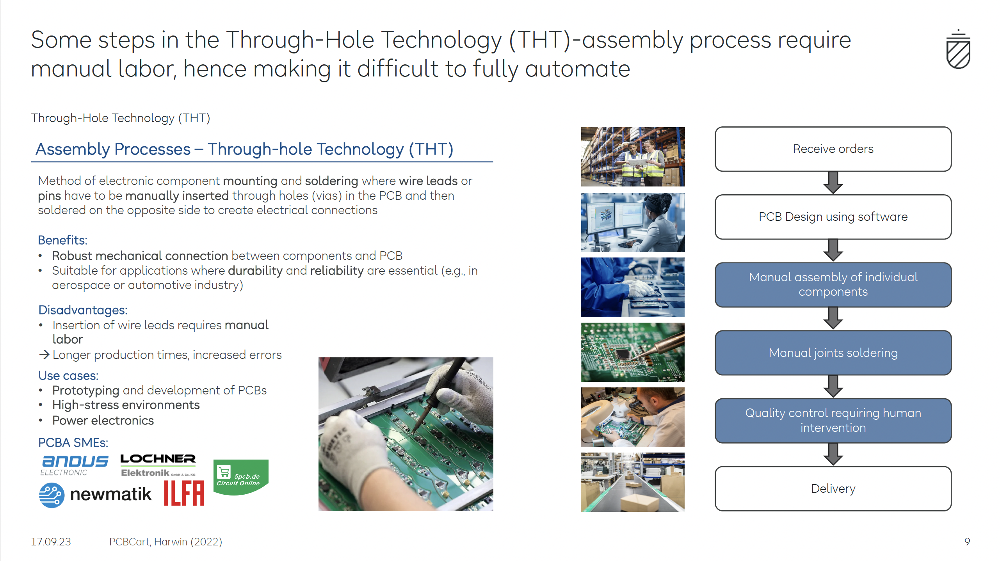
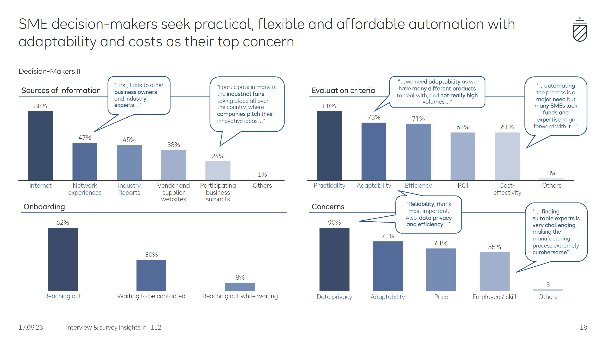
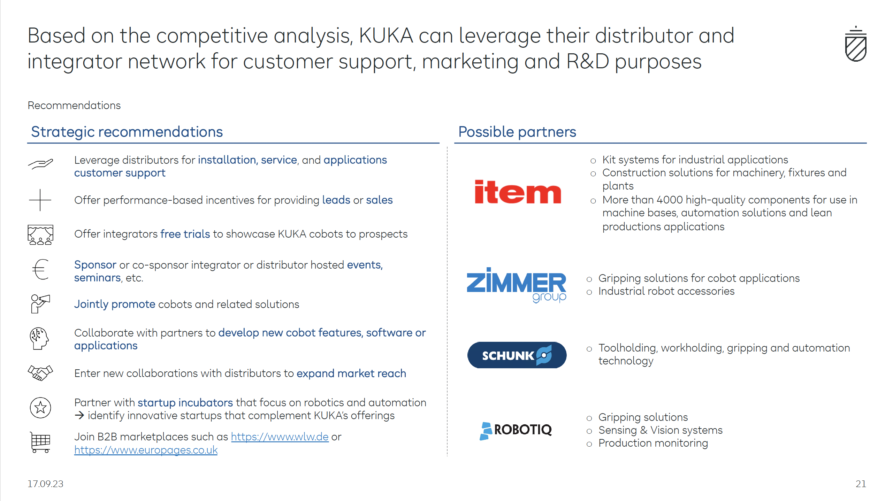

# KUKA PCBA Cobot Strategy Case Study

## 🚀 Overview

This project is a consulting-style strategy case study developed for **KUKA**, focused on identifying high-potential industries for collaborative robot (cobot) adoption.

The analysis identifies **European PCBA (Printed Circuit Board Assembly) SMEs** as a strong target segment due to:

* Increasing demand for electronics across industries
* Labor shortages in assembly processes
* Need for flexible, small-batch production
* Manual bottlenecks in Through-Hole Technology (THT)

---

## 🧩 Business Problem

KUKA aimed to:

* Identify an industry with strong automation potential
* Understand SME decision-making behavior
* Analyze where cobots create the most value in the value chain
* Develop a scalable go-to-market strategy

---

## 🎯 Key Recommendation

KUKA should target **European PCBA SMEs** and focus on automating critical manual processes:

* Component placement
* Soldering
* Quality control

### Go-to-market strategy:

* Attend industry events and trade fairs
* Collaborate with distributors and system integrators
* Offer leasing/subscription pricing models
* Provide employee training and technical support

---

## 🔍 Key Insights

* The PCBA industry is growing and highly fragmented
* SMEs focus on customization → require flexible automation
* THT assembly remains manual, time-consuming, and error-prone
* Decision-makers prioritize:

  * ROI
  * Adaptability
  * Efficiency
* Main adoption barriers:

  * High upfront costs
  * Lack of expertise
  * Integration complexity

---

## 📊 Visual Highlights

---

## 📄 Full Case Study

👉 [View Full Presentation](presentation/KUKA-PCBA-Cobot-Case-Study.pdf)

---

## 🛠 Skills Demonstrated

* Market Research & Industry Analysis
* Competitive Strategy
* Value Chain Analysis
* Customer Persona Development
* Business Strategy & Recommendations
* Data Storytelling & Presentation Design

---

## 👤 My Contribution

Contributed to structuring the case study, synthesizing research insights, and developing strategic recommendations for KUKA’s expansion into SME markets.

---

## 📌 Key Takeaway

This project demonstrates how combining **market research, strategic thinking, and clear communication** can translate complex industry problems into actionable business solutions.
